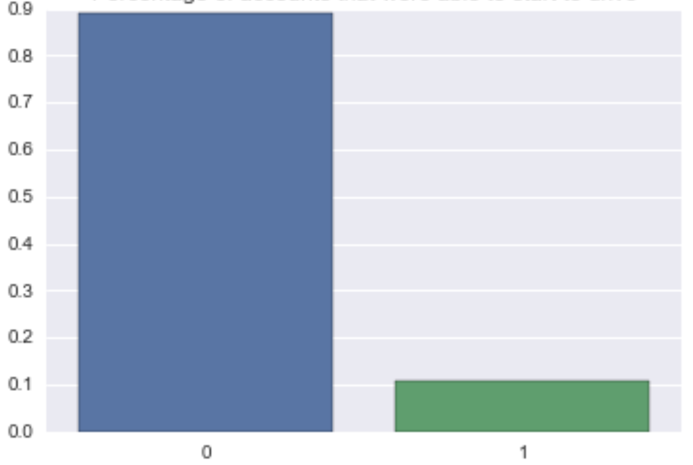
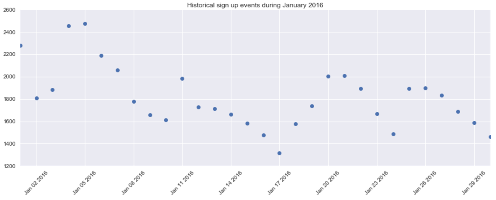
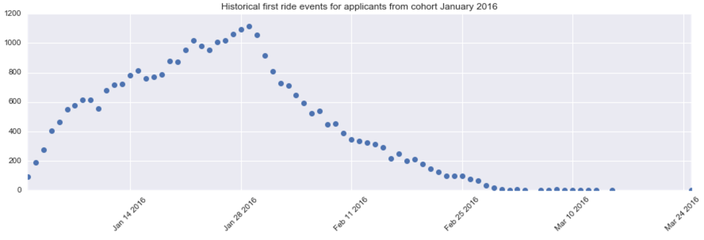

Creative test
=============

Ian Castillo
August 11, 2017

-----

## 1. SQL sintaxis

----

### 1.1. Mean and median difference

The following script represents a general solution. To review the exact query, you can access [here](q1.sql).


``` SQL
SELECT
  abs(mean(actual_eta) - mean(predicted_eta)) AS diff_mean
  abs(median(actual_eta) - median(predicted_eta)) AS diff_median
FROM
  trips
    LEFT JOIN 
  cities ON city_id = city_id	
WHERE
  city IN ('Qarth', 'Meereen')
    AND now - 30 days <= request_at;
```

-----

### 1.2. Rate of successful rides

The following script represents a general solution. To review the exact query, you can access [here](q1.sql).

``` SQL
SELECT
  city, 
  week_day,
  riders_complete_trip_7_days / riders AS successful_ride
FROM 
  events
    JOIN 
  trips ON rider_id = client_id
    LEFT JOIN
  cities ON city_id = city_id  
WHERE 
  event_name = 'sign_up_success'
    AND city IN ('Qarth', 'Meereen')
    AND year = 2016
    AND week_year = 1
GROUP BY
  city , week_day;
```

-----

## 2. Experiment and metrics design

-----

### 2.1. Primary success metric

The Uber partner's app redesign was aimed to help drivers in their daily work. Then the primary success metric should be aligned with the purpose of generate value to them.

There are four sections dedicated to help the partner:

1. **Home**: To instantly get updates and deliver information about oportunities.
2. **Earnings**: Interactive information to control partner's earnings.
3. **Ratings**: Shows strengths and areas of improvement for partners.
4. **Account**: Keeps more easily updated the information about the account.

-----

**Idea**: As a partner, I'd like to the new application helps me to earn more money in less time by offering opportunity spots and providing pro tips to develop my service.

#### Profit earned against hours logged in the app:

$$
\begin{aligned}
	\text{PLA}_{new} = \frac{\text{net weekly profit}}{\text{total hours logged in the new app}}
\end{aligned}
$$

$$
\begin{aligned}
	\text{PLA}_{old} = \frac{\text{net weekly profit}}{\text{total hours logged in the old app}}
\end{aligned}
$$

Where $\text{PLA}$ means Profit earned by hour logged in the app. Then, 

-----

#### Success metric:
$$
\begin{aligned}
	\text{S} = \text{PLA}_{new} - \text{PLA}_{old}
\end{aligned}
$$

Where $\text{S}$ is the difference that new design produces in the profit earned by one hour logged. But, this increment can't be representative of the driver's overall $\text{PLA}$. Then we can define, 

$$
\begin{aligned}
	\delta\text{S} = \frac{\text{S}}{PLA}
\end{aligned}
$$

where $\delta\text{S}$ represents **the change in the general driver's profit gained by one hour logged using the new design**.

-----

#### Additional metrics

Further, we can calculate other metrics to quantify the effectiveness of the new sections in the app:

1. **Average time bewteen two rides**. If the *heat map* helps the drivers, the average time to find a new ride should be less than using the old app's design.
2. **Increase rating score**. The *ratings* sections provides information to improve the service quality, then the rating score gained should be increase if the partner uses the section correctly.

-----

### 2.2. Testing plan to evaluation

In order to evaluate the performance of the new design (according to the success metric), three tools can be created to achive quick, constant and rigorous results:

1. **Daily automated reports**: A simple weekly mail or Slack message can be created to maintain the information within easy reach.
2. **Streaming Dashboard**: To continuously search risk, several interconnected metrics can be host in a dashboard so decision makers can have the metrics updated.

-----

3. **Monthly statistical testing**: More rigorous statistical test (average difference test, t-test if normallity checks or Wilcoxon-Mann-Whitney if not) can be perform within two groups (new app's users versus old app's users) every month. 

	Due to diversity of regions where the company is operatingIn order to accurate represent the population, a multistage sampling method can benefit the test. 
    
    There will be a need to indentify external factors that could affect the metrics and create control methods to eliminate their influence.
    
-----

### 2.3. Decision making

1. The **statistical test would function as a determining call** to decide if the new design is performing better according to *success metric*. Although, statistical test are not perfect-accuracy tools, the **constant monitoring** from dashboards and the review of metric **assumptions** would improve the test. 

2. **Defining benchmarks** to determinate the most likely metric value would lead us to creating an strategy to follow in the next months to establish if we have to roll back or create a new design for the application.

-----

## 3. Data analysis

The purpose of this exercise is create a model that allow us to predict which driver signups are most likely to start driving.

For a detailed report of modeling, you can check [this]('data_analysis_problem.ipynb') jupyter notebook.

---- 

### 3.1. What fraction of the driver signups took a first trip?

**Only a ~ 11% of accounts from the cohort of January 2016 started to drive in Uber** 

-----

### 3.2. Driver signups and first ride event from January 2016



-----

### 3.3. Variables used in the model

* **signup_channel**: what channel did the driver sign up from?
* **signup_os**: signup device of the user.
* **web_mobile**: what platform was used to create the account?
* **day_week**: day of the week the the account was created.
* **city**: Place where user signed up in.

**Information value by variable:**

<p align="center">
  
</p>

-----

### 3.4. Logistic regression model

#### Advantages:

* Logistic model is not indeed a classifier model, it allow us to estimate probabilites that can be more flexible and give us a range of decisions.
* This type of model provides a explanatory power due to simplicity and how to related bjective variable and predictor variables.

<small>**Note:** This model do not considerate the sufficient cases for a complete generalization. The training was made with a signup's cohort from January 2016.</small> 

-----

### 3.5. Model results

Best combo:

* signup_channel: **Referral**
* signup_os: **Mac**
* web_mobile: **Mobile**
* day_week: **Tuesday**
* city_name: **Berton**

-----

### 3.6. Model performance

<p align="center">
  
</p>

-----

### 3.7. Considerations

1. Acording to the model, a better referal strategy could lead to increase the expectative of a user signup and complete a trip.
2. Special atention on Mac and mobile users. Investigate the strata they come from.
3. Promote marketing on specific days of the week or places.